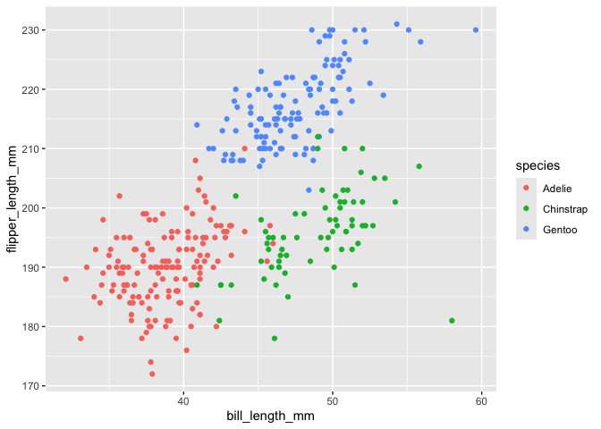

Homework 1
================
Irene Wen
2026-09-18

``` r
library(tidyverse)
```

# Problem 1

``` r
data("penguins", package = "palmerpenguins")
levels(pull(penguins, species))
```

    ## [1] "Adelie"    "Chinstrap" "Gentoo"

``` r
levels(pull(penguins, island))
```

    ## [1] "Biscoe"    "Dream"     "Torgersen"

The `penguins` dataset includes the species, island, bill length, bill
depth, flipper length, body mass, sex, and year for each penguin. There
are three species (“Adelie” “Chinstrap” “Gentoo” ) and three islands
(“Biscoe” “Dream” “Torgersen”).

``` r
nrow(penguins)
```

    ## [1] 344

``` r
ncol(penguins)
```

    ## [1] 8

``` r
penguins |> pull(flipper_length_mm) |> mean(na.rm = TRUE) |> round(2)
```

    ## [1] 200.92

The dataset has 344 rows and 8 columns, so there are 344 penguins and 8
variables.

The mean flipper length is 200.92 mm.

``` r
penguins_scatterplot =
  ggplot(
    penguins,
    aes(
      x = bill_length_mm,
      y = flipper_length_mm,
      color = species
    )
  ) +
  geom_point()

penguins_scatterplot
```

    ## Warning: Removed 2 rows containing missing values or values outside the scale range
    ## (`geom_point()`).

<!-- -->

``` r
ggsave(
  "penguins_scatterplot.png",
  plot = penguins_scatterplot,
  width = 7,
  height = 5
)
```

    ## Warning: Removed 2 rows containing missing values or values outside the scale range
    ## (`geom_point()`).

# Problem 2

``` r
set.seed(1)

problem2_df =
  tibble(
    norm_samp = rnorm(10),
    norm_samp_pos = norm_samp > 0,
    vec_char = c("a", "b", "c", "d", "e", "f", "g", "h", "i", "j"),
    vec_factor = factor(
      c("low", "medium", "high", "low", "medium",
        "high", "low", "medium", "high", "low")
    )
  )

problem2_df
```

    ## # A tibble: 10 × 4
    ##    norm_samp norm_samp_pos vec_char vec_factor
    ##        <dbl> <lgl>         <chr>    <fct>     
    ##  1    -0.626 FALSE         a        low       
    ##  2     0.184 TRUE          b        medium    
    ##  3    -0.836 FALSE         c        high      
    ##  4     1.60  TRUE          d        low       
    ##  5     0.330 TRUE          e        medium    
    ##  6    -0.820 FALSE         f        high      
    ##  7     0.487 TRUE          g        low       
    ##  8     0.738 TRUE          h        medium    
    ##  9     0.576 TRUE          i        high      
    ## 10    -0.305 FALSE         j        low

``` r
mean(pull(problem2_df, norm_samp))
```

    ## [1] 0.1322028

``` r
mean(pull(problem2_df, norm_samp_pos))
```

    ## [1] 0.6

``` r
mean(pull(problem2_df, vec_char))
```

    ## Warning in mean.default(pull(problem2_df, vec_char)): argument is not numeric
    ## or logical: returning NA

    ## [1] NA

``` r
mean(pull(problem2_df, vec_factor))
```

    ## Warning in mean.default(pull(problem2_df, vec_factor)): argument is not numeric
    ## or logical: returning NA

    ## [1] NA

Taking the mean works for the numeric and logical variables. For the
logical variable, the mean is the proportion of `TRUE` values. It
doesn’t work for the character and factor variables, which return `NA`
with a warning that the argument is not numeric or logical.

``` r
as.numeric(pull(problem2_df, norm_samp_pos))
as.numeric(pull(problem2_df, vec_char))
as.numeric(pull(problem2_df, vec_factor))
```

The logical variable becomes 1 for `TRUE` and 0 for `FALSE`. The
character variable becomes all `NA`, because letters can’t be converted
to numbers. The factor variable becomes the numbers 1, 2, and 3, which
are the codes R uses for its levels (high, low, medium in alphabetical
order).

This helps explain the means. The logical variable works because it is
stored as 0s and 1s. The character variable has no numeric values, so
there is nothing to average. The factor does have numeric codes
underneath, but `mean()` doesn’t convert factors, and the codes only
label categories, so their mean wouldn’t mean anything.
